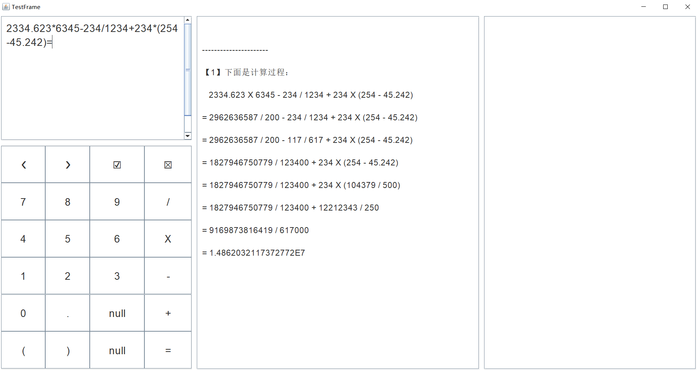

# 多功能计算器

* 此代码是作者出于兴趣爱好自己编写的。转载请注明。

* 作者的邮箱：contactwangpai@163.com

---

分支 M # 最新版本 ` M.2.2 ` 支持的功能：（以用户的角度）

1. 操作数支持多位运算。一个操作数可以是十位数或者更高位数的数
2. 操作数支持小数点、负数，运算结果支持显示小数、负数
3. 表达式可以含多个操作数、多个运算符，还可以带括号
4. 对输入的表达式提供实时自动语法检查与错误定位，并支持检查后的修改
5. 对输入无误的表达式进行实时自动计算，并可选显示完整详细的计算过程。
6. 使用 GUI 界面来显示上面的表达式输入、报错显示、运算过程
7. 提供界面按钮以供输入。按钮包含文本全选、光标左移与右移，选中文本的删除、输入替换
8. 支持键盘输入

---

# 本次更新介绍

——2021年8月11日

代码介绍：

&emsp;&emsp;本工程是在 本分支的上一版本的基础之上进行的升级。

&emsp;&emsp;相对于版本 ` M.2.1 `，本版本 ` M.2.2 ` 的改进主要有：

* 修改所有测试类的类名、方法名等信息。原因是 Maven 的测试插件 `maven-surefire-plugin` 默认只会测试如下的类方法：
  * 类的访问权限为 public，且类名含 test
  * 类的默认构造器的访问权限为 public
  * 方法的访问权限为 public，且方法名的前缀为 test
* 修复了一些 Bug，优化了一些代码
* 去除了 import 的通配符导入代码
* 去除了控制台输出

&emsp;&emsp;未来版本可能会实现的功能：

* 提供文本的清空、复制、剪切、粘贴按钮
* 提供文本的撤销和恢复快捷键

* 笔者使用的开发工具：IntelliJ IDEA 2020.1.2 (Ultimate Edition)

* 核心 Java 语言代码文件：

* 程序启动入口 API：

  >  模块 `calculator-core` 中的
  >
  >  > 包`org.wangpai.calculator`中的
  >  >
  >  > > 类 `CalculatorApplication` 中的
  >  > >
  >  > > > 静态方法 `main`

* Java 代码：
  - 总的代码行数为：6459
  - 单元测试代码行数为：1762

* 程序屏幕输入示例：`2334.623*6345-234/1234+234*(254-45.242)=`

* 一个屏幕输出结果的片段：

---

---

---

