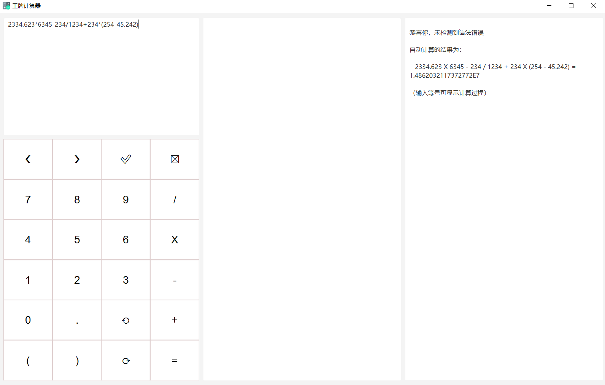
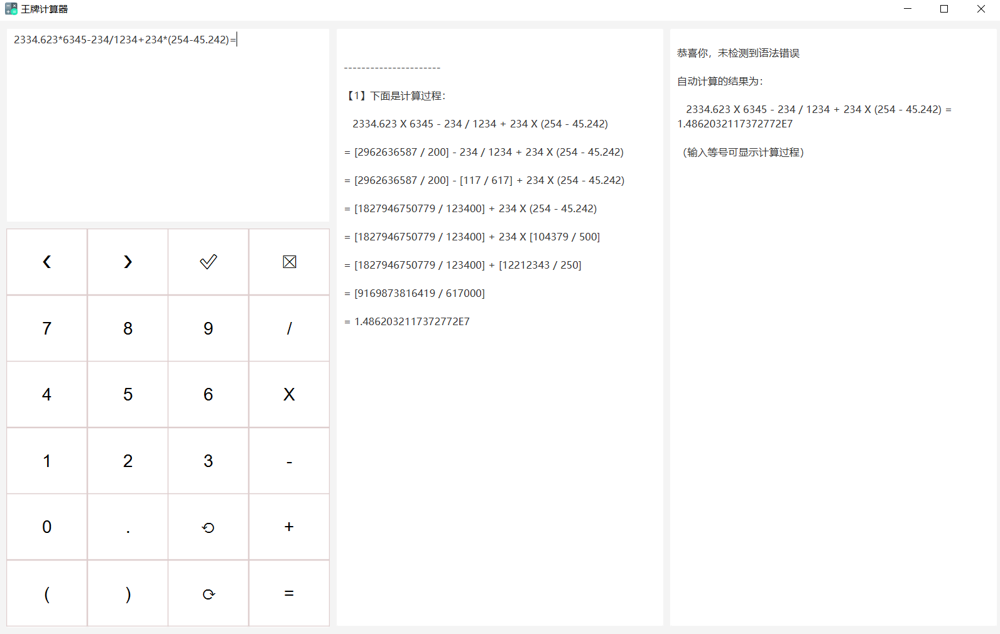
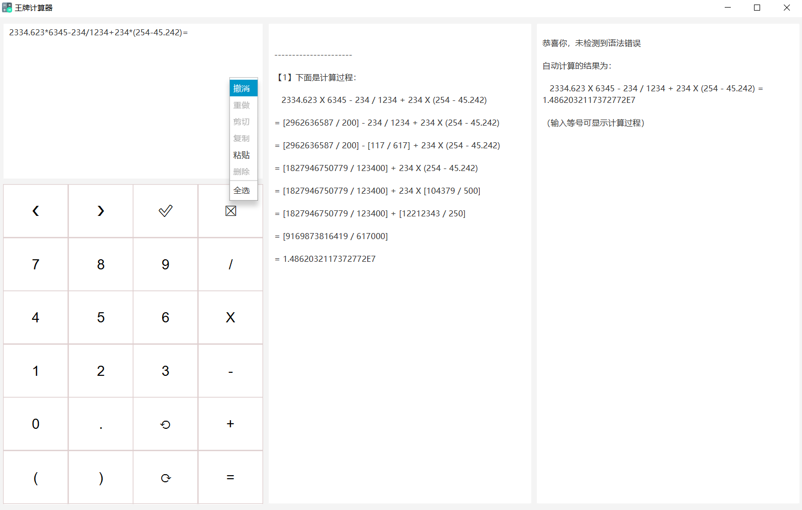

# 多功能计算器

* 此代码是作者出于兴趣爱好自己编写的。转载请注明。

* 作者的邮箱：contactwangpai@163.com

---

分支 M # 版本 ` M.3.1 ` 支持的功能：（以用户的角度）

1. 操作数支持多位运算。一个操作数可以是十位数或者更高位数的数

2. 操作数支持小数点、负数，运算结果支持显示小数、分数。

3. 表达式可以含多个操作数、多个运算符，还可以带括号

4. 对输入表达式提供实时自动语法检查与错误定位，并支持检查后的修改

5. 对输入无误的表达式进行实时自动无损计算，无运算累计误差，并可选显示详细的计算过程

6. 使用 GUI 界面来显示上面的表达式输入、报错显示、运算过程

7. 提供界面按钮以供鼠标点击输入。按钮功能包含击键变色、文本全选、光标左移与右移，选中文本的删除与替换、撤消与重做

8. 提供右键菜单以供撤消、重做、剪切、复制、粘贴、删除、全选

9. 支持键盘输入

10. 提供 Windows 下免安装 JDK 直接运行的 EXE 文件。此 EXE 程序拥有程序名、自制程序图标

---

# 本次更新介绍

——2021年10月12日

本次更新介绍：

&emsp;&emsp;本工程是在本分支的上一版本的基础之上进行的升级。

&emsp;&emsp;相对于版本 ` M.3.2.2 `，本版本 ` M.3.3 ` 的改进主要有：

* 引入了日志框架 SLF4J、Log4j。应用运行后，将生成 log 文件来输出日志信息。
* 消除了显示计算过程时，显示负数、分数时没有外加括号的 bug，并因此优化了算法。
* 优化了通信接口，消除了一些隐藏 bug。
* 为解决 Maven 多模块循环依赖的问题，独立出了一个新模块。
* 去掉了所有的注解 `@SneakyThrows`，改为使用原始 `try-catch` 块来 catch 异常，然后输出到日志中。该注解会无声地吞掉所有的异常，建议禁止使用。
* 新增了两个 Maven 插件。

---

&emsp;&emsp;本版本的已知不足与预想的改进方案：

* 本版暂无

---

&emsp;&emsp;未来版本可能会实现的功能：

* 提供文本的剪切、粘贴按钮（已提供剪切、粘贴右键菜单与快捷键）
* 提供更高级的运算符运算及语法解析
* 提供安卓环境与 Windows 环境的连接，可通过手机局域网来控制 Windows 应用

---

* 本项目使用的开发环境：
  - JDK 17 2021-09-14
  - JavaFX 17-ea+11
  - IntelliJ IDEA 2021.2.2 (Ultimate Edition)

---

* 核心 Java 语言代码文件：

* 程序启动入口 API：

  >  模块 `calculator-entrance` 中的
  >
  >  > 包 `org.wangpai.calculator` 中的
  >  >
  >  > > 类  `CalculatorApplication` 中的
  >  > >
  >  > > > 静态方法 `main`

---

* 总计：8544
* Java 代码：7747
  - 测试代码：1857

* 文本语言代码：797

  - FXML：204
  - CSS：33
  - Spring 配置、POM 文件：511
  - .properties：49

---

* 程序屏幕输入示例：`2334.623*6345-234/1234+234*(254-45.242)=`

---

* 一些程序截图片段：

---

---

---

---
