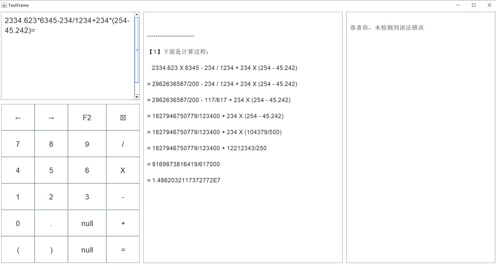

# 多功能计算器

* 此代码是作者出于兴趣爱好自己编写的。转载请注明。

* 作者的邮箱：contactwangpai@163.com

---

分支 M # 最新版本 M.1.0 支持的功能：（以用户的角度）

1. 操作数支持多位运算。一个操作数可以是十位数、百位数或者拥有更高数位的数
2. 操作数支持小数点、负数，运算结果支持显示小数、负数
3. 表达式可以含多个操作数、多个运算符，还可以带括号
4. 对具有上述要求的输入的表达式进行语法检查，并支持检查后的修改
5. 在得出计算结果之后，可以显示完整详细的计算过程。且在下一次计算时，之前的计算结果不会消失
6. 使用 GUI 界面来显示上面的表达式输入、报错显示、运算过程

---

 

# 本次更新介绍

——2021年8月1日

代码介绍：

&emsp;&emsp;本工程是在`20210308-多功能计算器`的基础之上进行的升级。由于即将推出下一个版本，因此本版本的介绍从略。另外，本版本也有一些未解决的问题，这些问题将在下一版本进行解决或指出。

&emsp;&emsp;相对于` M.0.0`，本版本的改进有：

* 使用了架构模式 MVC，并在 MVC 的基础之上，增加了 Service（服务）。
  - V：用于实现 GUI 界面
  - C：用于实现各组件之间的通信
  - M：提供操作数、运算符等的数据原型
  - S：利用 M 来实现计算器的关键算法
* 使用了设计模式有：
  - 中介者模式：用于 UI 界面中各组件之间、及与后端服务之间的交互
  - 模板方法模式：提供不同操作数类型的通用运算法则
  - 工厂模式：用于创建计算器GUI组件、控制器、服务等

* 笔者使用的开发工具：IntelliJ IDEA 2020.1.2 (Ultimate Edition)

* 核心 Java 语言代码文件：

* 程序测试启动入口 API：

  类 CalculatorFrame_Test 的方法 main：

  - 位于模块 calculator 的文件夹 Test
  - 包名：org.wangpai.calculator.view

* Java 代码：
  - 总的代码行数为：5185
  - 单元测试代码行数为：1791

> 5+31+17+22+102+263+71+5+75+147+26+158+5+136+25+187+274+173+208+33+89+21+594+54+145+57+241+81+84+25+216+71+40+62+22+43+33+113+42+154+42+188+200+32+32+34+16+31+22+58+32+27+30+27+27+60+33+36+35+36+37=5185
>
> 71+40+62+22+43+33+113+42+154+301+188+200+32+32+34+16+31+200+33+36+35+36+37=1791

* 程序屏幕输入示例：`2334.623*6345-234/1234+234*(254-45.242)=`

* 一个屏幕输出结果的片段：

---

---

