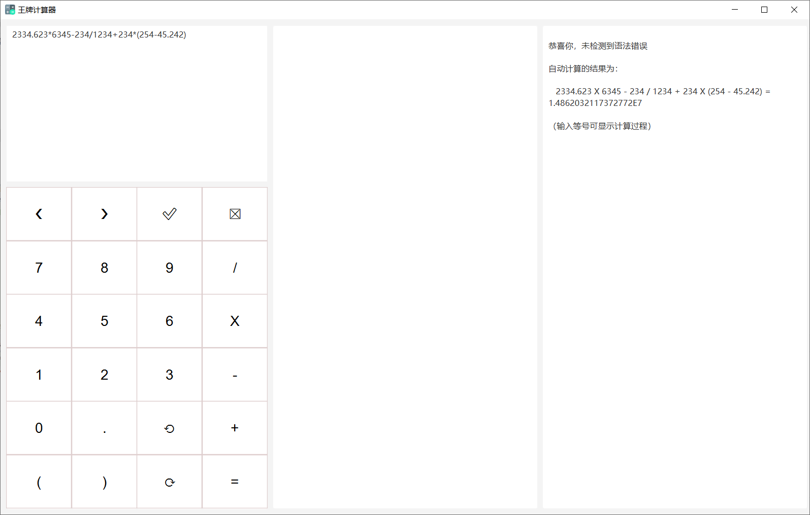
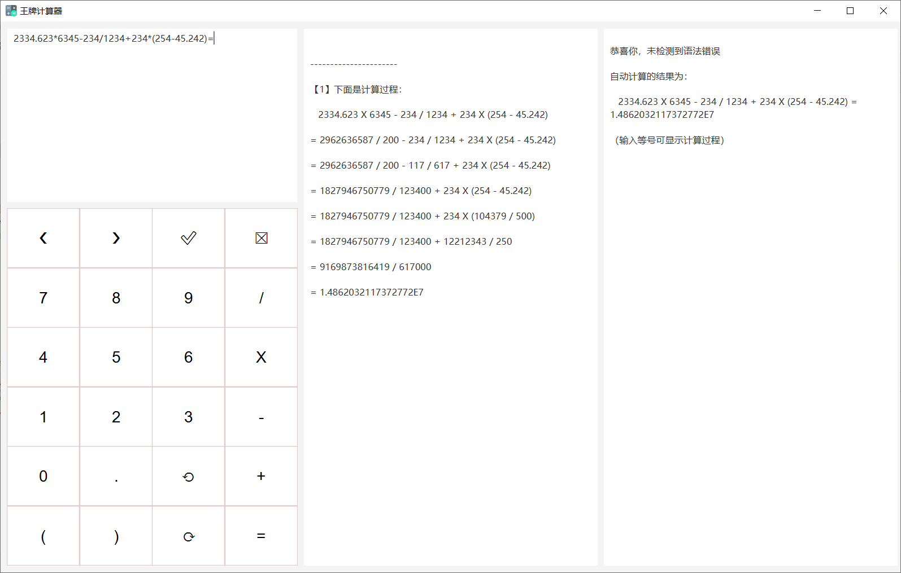
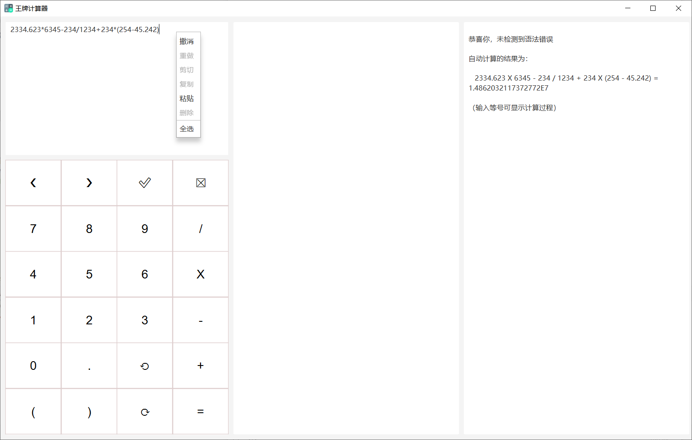

# 多功能计算器

* 此代码是作者出于兴趣爱好自己编写的。转载请注明。

* 作者的邮箱：contactwangpai@163.com

---

分支 M # 最新版本 ` M.3.1 ` 支持的功能：（以用户的角度）

1. 操作数支持多位运算。一个操作数可以是十位数或者更高位数的数

2. 操作数支持小数点、负数，运算结果支持显示小数、负数

3. 表达式可以含多个操作数、多个运算符，还可以带括号

4. 对输入的表达式提供实时自动语法检查与错误定位，并支持检查后的修改

5. 对输入无误的表达式进行实时自动计算，并可选显示完整详细的计算过程

6. 使用 GUI 界面来显示上面的表达式输入、报错显示、运算过程

7. 提供界面按钮以供鼠标点击输入。按钮功能包含击键变色、文本全选、光标左移与右移，选中文本的删除与替换、撤消与重做

8. 提供右键菜单以供撤消、重做、剪切、复制、粘贴、删除、全选

9. 支持键盘输入

10. 提供 Windows 下免安装 JDK 直接运行的 EXE 文件。此 EXE 程序拥有程序名、自制程序图标

---

# 本次更新介绍

——2021年10月4日

代码介绍：

&emsp;&emsp;本工程是在 本分支的上一版本的基础之上进行的升级。

&emsp;&emsp;相对于版本 ` M.3.2 `，本版本 ` M.3.2.1 ` 的改进主要有：

* 解决了上一版本 UI 界面会进入阻塞状态的问题。
  - 原因：此问题首先由 Spring  Bean 初始化过慢（Spring Bean 初始化大概用了 3~4s）引起，然后当时该初始化代码还位于 JavaFX 线程安全函数 `Platform.runLater` 中，从而阻塞 UI，现象是 UI 界面停止响应，光标变成圆圈。
  - 解决办法：将非 UI 线程中的 Spring  Bean 初始化代码从安全函数中移出到非 UI 线程中的其它地方，具体地方为非 UI 线程中安全函数之前的位置。这样一来，UI 启动之后，虽然 Spring  Bean 初始化仍然要消耗很多时间，但 UI 界面并没有被阻塞，而是显示为空白，直到各组件初始化结束。这样一来，用户体验大大提高。
  - 结果：UI 界面在 2s 内启动，UI 内各组件在 5s 内初始化，且 UI 界面没有肉眼可见阻塞。

---

&emsp;&emsp;本版本的已知不足与预想的改进方案：

* 本版暂无

---

&emsp;&emsp;未来版本可能会实现的功能：

* 提供文本的剪切、粘贴按钮（已提供剪切、粘贴右键菜单与快捷键）

---

* 本项目使用的开发环境：
  - JDK 17 2021-09-14
  - JavaFX 17-ea+11
  - IntelliJ IDEA 2021.2.2 (Ultimate Edition)

---

* 核心 Java 语言代码文件：

* 程序启动入口 API：

  >  模块 `calculator-entrance` 中的
  >
  >  > 包`org.wangpai.calculator`中的
  >  >
  >  > > 类 `CalculatorApplication` 中的
  >  > >
  >  > > > 静态方法 `main`

---

* 总计：7964
* Java 代码：7369
  - 测试代码：1857

* ML、CSS 代码：595

  - FXML：204
  - CSS：33
  - Spring 配置、POM 文件：358

---

* 程序屏幕输入示例：`2334.623*6345-234/1234+234*(254-45.242)=`

---

* 一些程序截图片段：

---

---

---

---
