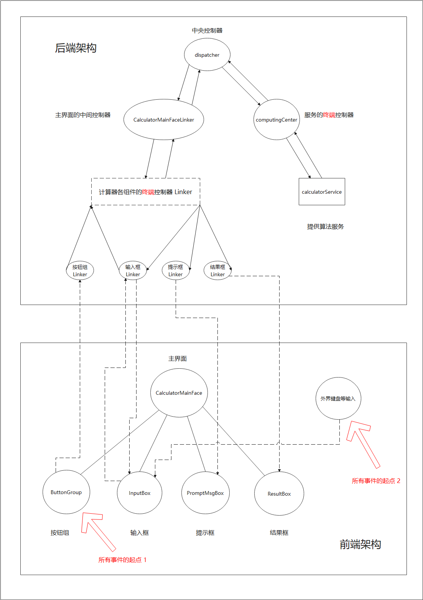

[TOC]

本项目的架构简介

（版本 M.3.3）

——2021年10月21日

# 架构模式

&emsp;&emsp;本项目采用了架构模式 MVC。具体来说，项目分为以下几个部分：

* V：提供计算器各组件及主界面的实现
* M：提供运算符、操作数等的底层实现
* DAO：提供对 M 的一些常规处理与封装
* Service：借助 DAO，对从 V 中传来的数据进行处理并反馈
* C：用于实现 V 与 S 之间的通信与解耦

&emsp;&emsp;图中本项目的各个组件之间使用 URL 来进行通信，对 RPC 技术进行了模拟。其中，URL 遵循 RESTful 规范，格式为 `/组件路径/操作或数据名`，如 `/view/inputBox/leftShift` 代表向前端的组件 `inputBox` 来发送 `leftShift` 信息、`/service/expression` 代表向后端发送 `expression` 信息。

# 设计模式

&emsp;&emsp;本项目使用的设计模式有：

* 职责链模式：
  - 用于实现多级控制器，完成视图与服务之间的通信与解耦
* 适配器模式：
  - 用于解决 JavaFX 技术与 Spring 技术不相容的问题
* 单例模式：
  - 用于保证全局“懒加载”变量的线程安全
* 中介者模式：
  - 用于实现主界面中各组件之间的通信与解耦
* 观察者模式：
  - 提供实时计算与计算过程实时显示的功能
* 解释器模式：
  - 提供表达式解析的功能
* 组合模式：
  - 将运算符、操作数归一化
* 装饰模式：
  - 用于增强系统默认提供的 UI 组件
* 原型模式：
  - 用于实现多种操作数等的复制问题
* 工厂模式：
  - 用于异常类的创建
  - 用于各组件等的创建【版本 M.2.0 起废弃，改用 Spring 进行依赖注入与初始化】
* 模板方法模式：
  - 提供协变运算方法的具体与抽象【版本 M.1.2 起废弃】

# 除上述外，还使用了哪些技术关键词

* JavaFX
* Spring
* Java 多线程
* Maven
* JUnit5
* Lombok
* SLF4J、Log4j
* CSS
* FXML（HTML、XML）
* Java Swing（版本 M.3.0 起废弃）

# 模块介绍

&emsp;&emsp;本项目包含以下模块：

* calculator-entrance：存放计算器的启动程序入口
* calculator-exception：本项目需要使用的各种异常
* calculator-ui：计算器的 UI 界面
* calculator-ui-depended：此模块源自模块 `calculator-ui`。为了解决 Maven 模块间的循环依赖问题才分离出该模块
* calculator-backend：计算器的后端程序

# 包名介绍

&emsp;&emsp;本项目中的包名（省略前缀 `org.wangpai.calculator`）controller、model、service、view、exception 分别对应于上面提到的控制器、模型、服务、视图、异常。

# 测试

* 本项目中的测试的类包名后缀如果为某测试框架的框架名，则表明该测试类在测试时使用了该测试框架。如后缀为 `junit5`，代表该测试类使用了测试框架 JUnit5 。
* 如果包名后缀不为任何测试框架的框架名，而完全与被测试类的包名一致，则意味着被测试类往往为 GUI 组件，不方便使用测试框架进行测试。这种类的测试往往依靠手动运行来完成。

# 程序运行入口

&emsp;&emsp;本项目的程序运行入口为：

> 见本项目根路径下的文档 `README.md`。

